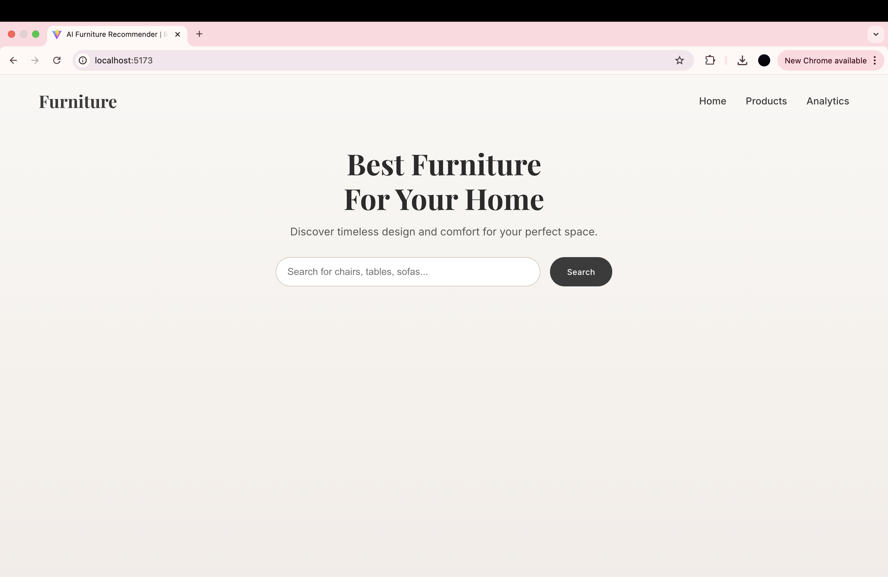
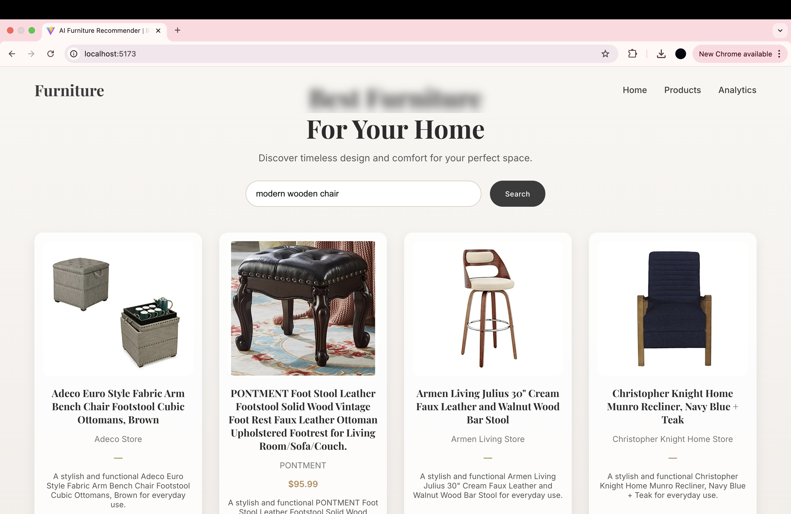
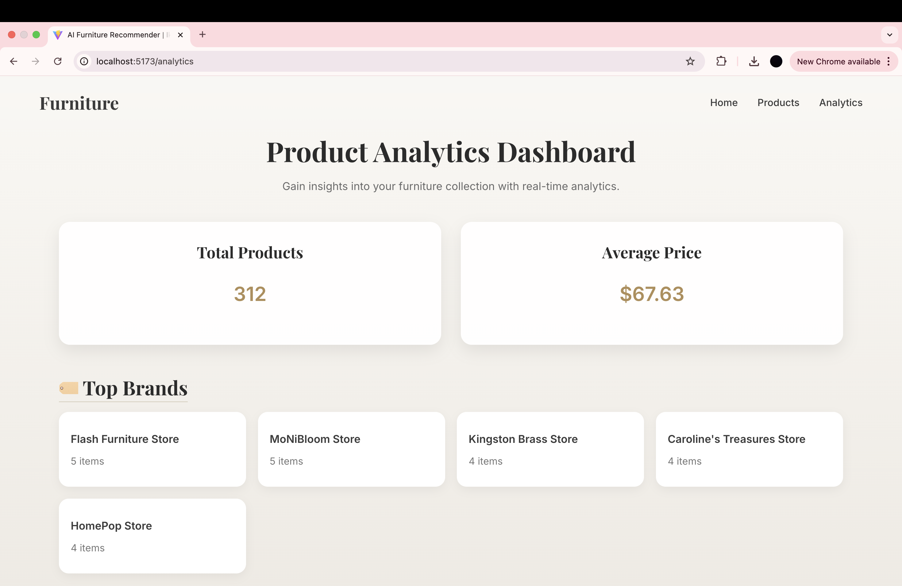

🪑 AI Furniture Recommendation & Analytics Web App

A full-stack AI-powered furniture recommendation system built using FastAPI, React (Vite), and Machine Learning — featuring natural language search, computer vision classification, analytics dashboard, and elegant UI design inspired by modern luxury furniture brands.

✨ Project Preview

    <em>🏠 Elegant Landing Page — warm beige-brown theme with luxury furniture design aesthetics</em> 
 
    <em>🪑 Smart Recommendation Flow — users search naturally, and AI suggests context-aware furniture items</em> 
 
    <em>📊 Insightful Analytics Dashboard — interactive view of top brands, categories, and pricing insights</em> 

 Overview

This project is an end-to-end AI web application that recommends furniture products based on user queries.
It uses Machine Learning, Natural Language Processing, Computer Vision, and Generative AI (Gemini) to deliver smart product recommendations, creative descriptions, and a stunning frontend experience.

The app also includes an analytics dashboard that visualizes trends, top categories, and product statistics from the dataset.

 Features
Domain	Feature	Description
ML	Recommendation Model	Suggests similar furniture products based on text embeddings
NLP	Semantic Search	Groups and retrieves related products via Sentence Transformer embeddings
CV	Image Classifier	Uses a CNN model to categorize product images (e.g., chair, table, sofa)
GenAI	Description Generation	Uses Google Gemini API to generate natural product descriptions
Vector DB	Semantic Storage	Stores text/image embeddings for similarity search (Pinecone / FAISS)
Frontend	Elegant UI	React + MUI + gradient beige-brown theme inspired by modern design
Backend	API Integration	FastAPI routes serve recommendations, analytics, and ML model outputs
Analytics	Dashboard	Displays brand/category analytics and average price distributions
🧩 Tech Stack
Layer	Technology
Frontend	React (Vite), Material UI (MUI), Axios
Backend	FastAPI, Uvicorn
Database	Vector DB (Pinecone / FAISS), CSV Dataset
ML/NLP	Sentence Transformers, Scikit-learn, OpenCV, TensorFlow / PyTorch
GenAI	Google Gemini API via LangChain
Data Visualization	Matplotlib / Plotly (for analytics notebook)
📁 Project Structure
furniture-recommender/
├── backend/
│   ├── main.py                  # FastAPI backend with all routes
│   ├── models/
│   │   ├── recommender_model.joblib
│   │   ├── image_model.pt
│   │   ├── furniture_embeddings.csv
│   │   └── furniture_data_with_embeddings.csv
│   ├── requirements.txt
│   └── notebooks/
│       ├── Data_Analytics.ipynb       # Data insights & visualization
│       └── Model_Training.ipynb       # Embedding + ML training
│
├── frontend/
│   ├── ikarus_manraj/
│   │   ├── index.html
│   │   ├── package.json
│   │   ├── vite.config.js
│   │   ├── src/
│   │   │   ├── App.jsx
│   │   │   ├── main.jsx
│   │   │   ├── index.css
│   │   │   ├── components/
│   │   │   │   ├── Navbar.jsx
│   │   │   │   └── ScrollToTop.jsx
│   │   │   └── pages/
│   │   │       ├── Recommend.jsx
│   │   │       └── Analytics.jsx
│
├── data/
│   └── intern_data_ikarus.csv         # Dataset provided
│
├── README.md
└── venv/

⚙️ Installation & Setup

Follow these steps to run the project locally:

🧠 1. Clone the Repository
git clone https://github.com/<your-username>/furniture-recommender.git
cd furniture-recommender

🖥️ 2. Backend Setup (FastAPI)
cd backend
python3 -m venv venv
source venv/bin/activate
pip install -r requirements.txt

Run FastAPI server:
uvicorn main:app --reload

Server runs at:
👉 http://127.0.0.1:8000

💻 3. Frontend Setup (React + Vite)
cd ../frontend/ikarus_manraj
npm install
npm run dev

Frontend runs at:
👉 http://localhost:5173

🔗 4. API Integration (Verify)

Your FastAPI backend endpoints:

GET / → Health check

POST /recommend → Product recommendations

GET /analytics → Product dataset analytics

Example request:

{
  "query": "modern wooden chair",
  "top_n": 3
}

🧮 Notebooks
Notebook	Description
Model_Training.ipynb	Preprocesses data, generates embeddings, trains recommendation & CV models
Data_Analytics.ipynb	Analyzes trends — brands, pricing, materials, and category breakdowns

Each notebook is richly commented for clarity and reasoning.

🎨 Design Aesthetic

Inspired by LuxDesign furniture websites —
a modern, minimalist aesthetic with:

Creamy beige & white gradients

Glassmorphism cards

Subtle shadows and hover transitions

Elegant Inter typography

Professional golden-brown accent (#b08d57)

🧠 AI & ML Logic Flow

Text Embedding:
SentenceTransformer model converts product titles + descriptions → semantic vectors.

Image Classification:
A CNN/ResNet model classifies product images into categories.

Vector Search:
Embeddings stored in a vector database (Pinecone / FAISS) for nearest-neighbor lookup.

Recommendation Engine:
Cosine similarity determines top related furniture items.

Generative Description:
Google Gemini API creates a short creative product description.

Frontend Rendering:
React fetches recommendations from FastAPI and displays them beautifully.

📊 Analytics Features

Average price visualization

Top brands by product count

Top categories by frequency

Country of origin distribution

Material usage breakdown

📌 Environment Variables

In your backend .env file (if applicable):

GEMINI_API_KEY=your_google_gemini_key
PINECONE_API_KEY=your_pinecone_key

🧰 Requirements

Main Python dependencies (from requirements.txt):

fastapi
uvicorn
scikit-learn
sentence-transformers
torch
pandas
numpy
langchain
google-generativeai
Pillow

Frontend dependencies (React):

react
react-router-dom
@mui/material
axios
vite

🧪 Example Output
Input:

“modern wooden chair”

Output:
{
  "query": "modern wooden chair",
  "recommendations": [
    {
      "title": "Adeco Euro Style Fabric Arm Bench Chair",
      "brand": "Adeco Store",
      "price": "$85.00",
      "image": "https://m.media-amazon.com/images/I/41hUc8c+DCL._SS522_.jpg",
      "description": "A stylish and functional Adeco Euro Style Chair perfect for modern living spaces."
    },
    ...
  ]
}

🌟 Highlights

✅ Fully functional ML + NLP + CV + GenAI integration
✅ Clean, modern React + FastAPI architecture
✅ Professional-grade UI inspired by real furniture websites
✅ Modular, well-commented notebooks
✅ Ready for deployment & portfolio presentation